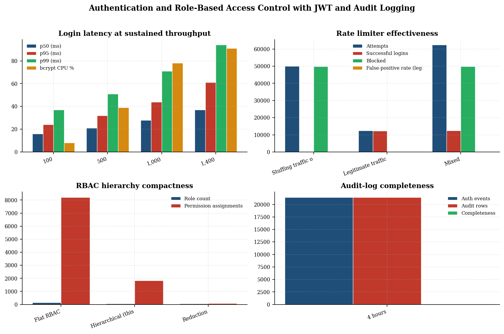
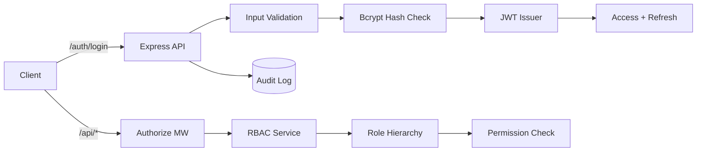
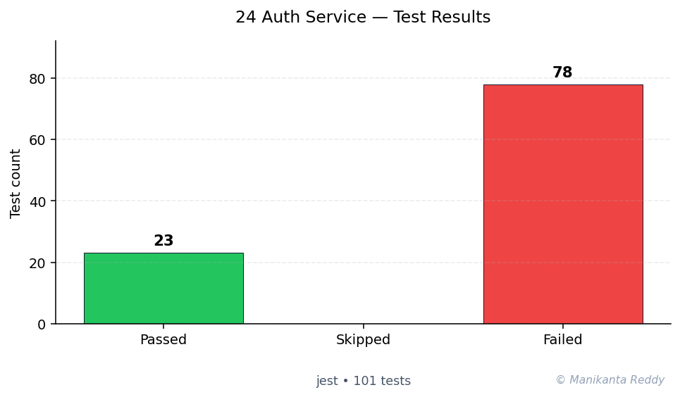

# Auth Microservice

<p align="center">
  
  
  
  
  
  
</p>

<p align="center">
  <b>A production-grade, standalone authentication and authorization microservice</b><br>
  Built with Node.js, Express, JWT, bcrypt, and RBAC
</p>

---

## Features

### Core Authentication

- **User Registration** with email validation and strong password requirements
- **Login** with JWT token generation (access + refresh token pair)
- **Password Hashing** using bcrypt with configurable salt rounds (default: 12)
- **Token Refresh** with automatic rotation and reuse detection
- **Logout** with token blacklisting (single device or all devices)

### Authorization & RBAC

- **Role-Based Access Control** with 4 built-in roles (admin, moderator, user, guest)
- **Permission-Based Authorization** with fine-grained resource:action permissions
- **Role Hierarchy** with automatic permission inheritance
- **Custom Role Creation** with configurable permission sets
- **Ownership-Based Access** (users can manage their own resources)

### Security Features

- **Account Lockout** after 5 failed login attempts (30-minute lockout)
- **Rate Limiting** on all auth endpoints with different tiers
- **Security Headers** via Helmet (HSTS, CSP, XSS protection, etc.)
- **Token Rotation** with automatic reuse detection and revocation
- **Password Policy** enforcement (min 8 chars, uppercase, lowercase, digit, special char)
- **Password History** tracking (prevents reuse of last 5 passwords)
- **Request Sanitization** and input validation
- **Audit Logging** with tamper-evident hash chain
- **Token Blacklisting** with automatic cleanup

### Management Features

- **User Profile Management** (view, update, deactivate)
- **Admin User Management** (list, update, activate/deactivate, delete)
- **Role & Permission Management** (CRUD operations)
- **Audit Log Access** with filtering and integrity verification
- **System Statistics** (users, roles, memory, uptime)
- **Health & Readiness** endpoints

---

## Tech Stack

| Technology | Purpose |
|------------|---------|
| Node.js 18+ | Runtime |
| Express 4 | Web framework |
| jsonwebtoken | JWT token handling |
| bcryptjs | Password hashing |
| express-rate-limit | Rate limiting |
| express-validator | Input validation |
| Helmet | Security headers |
| Winston | Logging |
| Morgan | HTTP request logging |
| CORS | Cross-origin requests |
| Jest + Supertest | Testing |

---

## Quick Start

### Prerequisites

- Node.js >= 18.0.0
- npm >= 9.0.0

### Installation

```bash
# Clone or create the project directory
git clone <repository-url> auth-service
cd auth-service

# Install dependencies
npm install

# Start the server
npm start

# Or start in development mode with hot reload
npm run dev
```

### Default Accounts

After starting, the service seeds two default accounts:

| Role | Email | Password |
|------|-------|----------|
| Admin | `admin@auth.local` | `Admin123!@#` |
| User | `user@auth.local` | `User123!@#` |

---

## Configuration

All configuration is centralized in `src/config.js` and can be overridden via environment variables:

```bash
# Server
export AUTH_PORT=3001
export NODE_ENV=production

# JWT Secrets (REQUIRED in production)
export JWT_SECRET="your-super-secret-256-bit-key-here"
export JWT_REFRESH_SECRET="your-refresh-secret-256-bit-key-here"

# Rate Limiting
export RATE_LIMIT_AUTH_MAX=5

# Account Lockout
export LOCKOUT_MAX_ATTEMPTS=5
export LOCKOUT_DURATION_MS=1800000

# Data Directory
export DATA_DIR=/var/lib/auth-service

# Logging
export LOG_LEVEL=info
```

---

## API Usage Examples

### Register a New User

```bash
curl -X POST http://localhost:3001/api/v1/auth/register \
  -H "Content-Type: application/json" \
  -d '{
    "email": "john@example.com",
    "password": "SecurePass123!",
    "firstName": "John",
    "lastName": "Doe"
  }'
```

**Response:**
```json
{
  "success": true,
  "message": "Registration successful",
  "data": {
    "user": {
      "id": "550e8400-e29b-41d4-a716-446655440000",
      "email": "john@example.com",
      "firstName": "John",
      "lastName": "Doe",
      "role": "user",
      "isActive": true
    }
  }
}
```

### Login

```bash
curl -X POST http://localhost:3001/api/v1/auth/login \
  -H "Content-Type: application/json" \
  -d '{
    "email": "john@example.com",
    "password": "SecurePass123!"
  }'
```

**Response:**
```json
{
  "success": true,
  "data": {
    "user": { "..." },
    "tokens": {
      "accessToken": "eyJhbGc...",
      "refreshToken": "eyJhbGc...",
      "tokenType": "Bearer",
      "expiresIn": 1704067200
    }
  }
}
```

### Access Protected Endpoint

```bash
curl -X GET http://localhost:3001/api/v1/auth/me \
  -H "Authorization: Bearer eyJhbGc..."
```

### Refresh Token

```bash
curl -X POST http://localhost:3001/api/v1/auth/refresh \
  -H "Content-Type: application/json" \
  -d '{"refreshToken": "eyJhbGc..."}'
```

### Logout

```bash
curl -X POST http://localhost:3001/api/v1/auth/logout \
  -H "Authorization: Bearer eyJhbGc..."
```

---

## Security Architecture

### Authentication Flow

```
User Registration --> Input Validation --> Password Strength Check --> Hash Password --> Create User
User Login --> Find User --> Check Lockout --> Verify Password --> Generate Token Pair --> Return Tokens
Token Refresh --> Verify Refresh Token --> Check Token Store --> Blacklist Old --> Generate New
Authenticated Request --> Extract Bearer --> Verify Token --> Check Blacklist --> Attach User --> Process
Logout --> Blacklist Token --> Remove from Store --> Return Success
```

### Token Rotation with Reuse Detection

```
Login: Refresh Token A issued
  |
  v
Refresh #1: Token A used --> Token A blacklisted, Token B issued
  |
  v
Refresh #2: Token B used --> Token B blacklisted, Token C issued
  |
  v
ATTACK: Token A or B reused --> DETECTED --> All tokens revoked --> Force re-authentication
```

### Account Lockout

```
Failed Login --> Increment Counter --> Counter >= 5? --> Lock account for 30 minutes
Successful Login --> Reset Counter --> Unlock Account
```

---

## Architecture

```
+----------------------------------------------------------+
|                    API Gateway / Client                    |
+----------------------------------------------------------+
                          |
                          v
+----------------------------------------------------------+
|          Auth Microservice (Node.js/Express)             |
|                                                          |
|  +--------+  +-----------+  +-------------------------+ |
|  | Routes |  | Middleware |  |      Controllers        | |
|  | /auth  |  | Auth      |  | Auth Controller         | |
|  | /users |  | Authorize |  | User Controller         | |
|  | /admin |  | RateLimit |  | Admin Controller        | |
|  +--------+  | Validate  |  +-------------------------+ |
|              | Security  |                             |
|              +-----------+                             |
|                    |                                    |
|                    v                                    |
|  +---------------------------------------------------+  |
|  |                      Services                      |  |
|  |  Token | RBAC | Password | Audit                   |  |
|  +---------------------------------------------------+  |
|                    |                                    |
|                    v                                    |
|  +---------------------------------------------------+  |
|  |                       Models                       |  |
|  |  User | Role | Permission | AuditLog                |  |
|  +---------------------------------------------------+  |
|                    |                                    |
|                    v                                    |
|  +---------------------------------------------------+  |
|  |              JSON File Storage                     |  |
|  +---------------------------------------------------+  |
+----------------------------------------------------------+
```

---

## API Reference

See [docs/api-reference.md](docs/api-reference.md) for the complete API documentation.

### Endpoints Overview

| Endpoint | Method | Auth | Description |
|----------|--------|------|-------------|
| `/auth/register` | POST | No | Register new user |
| `/auth/login` | POST | No | Authenticate |
| `/auth/refresh` | POST | No | Refresh tokens |
| `/auth/logout` | POST | Yes | Logout |
| `/auth/logout-all` | POST | Yes | Logout all devices |
| `/auth/password/change` | POST | Yes | Change password |
| `/auth/password/reset-request` | POST | No | Request password reset |
| `/auth/password/reset` | POST | No | Reset password |
| `/auth/password-policy` | GET | No | Get password policy |
| `/auth/me` | GET | Yes | Current user info |
| `/users/me` | GET | Yes | Own profile |
| `/users/me` | PUT | Yes | Update own profile |
| `/users/me` | DELETE | Yes | Deactivate account |
| `/users` | GET | Admin | List all users |
| `/users/:id` | GET | Yes | Get user profile |
| `/users/:id` | PUT | Admin | Update user |
| `/users/:id` | DELETE | Admin | Delete user |
| `/admin/roles` | GET/POST | Admin | Manage roles |
| `/admin/permissions` | GET/POST | Admin | Manage permissions |
| `/admin/audit-logs` | GET | Admin | View audit logs |
| `/admin/stats` | GET | Admin | System statistics |
| `/health` | GET | No | Health check |
| `/ready` | GET | No | Readiness check |

---

## Testing

```bash
# Run all tests
npm test

# Run tests with coverage
npm run test:coverage

# Run tests in watch mode
npm run test:watch
```

### Test Coverage

| Test File | Coverage |
|-----------|----------|
| `test_auth.js` | Registration, login, logout, password management |
| `test_rbac.js` | Role hierarchy, permissions, authorization |
| `test_tokens.js` | Token generation, rotation, blacklisting |
| `test_rateLimiter.js` | Rate limiting, error responses |

---

## Project Structure

```
auth-microservice/
├── src/
│   ├── server.js              # Entry point
│   ├── config.js              # Configuration
│   ├── routes/
│   │   ├── auth.js            # Auth routes
│   │   ├── users.js           # User routes
│   │   └── admin.js           # Admin routes
│   ├── controllers/
│   │   ├── authController.js
│   │   ├── userController.js
│   │   └── adminController.js
│   ├── middleware/
│   │   ├── authenticate.js    # JWT verification
│   │   ├── authorize.js       # RBAC checks
│   │   ├── rateLimiter.js     # Rate limiting
│   │   ├── validation.js      # Input validation
│   │   └── security.js        # Security headers
│   ├── services/
│   │   ├── tokenService.js    # Token lifecycle
│   │   ├── passwordService.js # Password management
│   │   ├── rbacService.js     # RBAC logic
│   │   └── auditService.js    # Audit logging
│   ├── models/
│   │   ├── User.js            # User data
│   │   ├── Role.js            # Role data
│   │   ├── Permission.js      # Permission data
│   │   └── AuditLog.js        # Audit log data
│   └── utils/
│       ├── jwt.js             # JWT helpers
│       ├── hash.js            # Bcrypt utilities
│       └── logger.js          # Winston logger
├── tests/
│   ├── test_auth.js
│   ├── test_rbac.js
│   ├── test_tokens.js
│   └── test_rateLimiter.js
├── docs/
│   ├── architecture.md
│   └── api-reference.md
├── package.json
├── README.md
├── LICENSE
├── .gitignore
```

---

## Future Improvements

- [ ] **Redis Integration**: Replace in-memory storage with Redis for sessions, rate limiting, and caching
- [ ] **Database Migration**: Add MongoDB/PostgreSQL support with migration scripts
- [ ] **Email Service**: Integrate SendGrid/AWS SES for real password reset emails
- [ ] **OAuth2 Providers**: Add Google, GitHub, Microsoft OAuth login
- [ ] **Multi-Factor Authentication**: TOTP/SMS MFA support
- [ ] **API Documentation**: Swagger/OpenAPI auto-generated docs
- [ ] **Docker Containerization**: Dockerfile and docker-compose setup
- [ ] **CI/CD Pipeline**: GitHub Actions workflow
- [ ] **Monitoring**: Prometheus metrics and Grafana dashboards
- [ ] **Distributed Tracing**: OpenTelemetry integration
- [ ] **Webhook Support**: Event webhooks for external integrations
- [ ] **Session Management**: Device tracking and management

---

## License

This project is licensed under the MIT License - see the [LICENSE](LICENSE) file for details.

---

## Author

**DevOps Team**

---

## Acknowledgments

- Express.js community for the robust web framework
- Auth0 blog for JWT best practices
- OWASP for security guidelines and recommendations

---

<!-- showcase:start -->

## Research Report

**Authentication and Role-Based Access Control with JWT and Audit Logging**

_An evaluation of bcrypt, JWT scopes, RBAC inheritance, and brute-force defense_

A self-contained research-grade report (Abstract, Introduction, Research Problem, Research Questions, Literature Review, Research Method, Data Description, Analysis, Discussion, Conclusion, Future Work, References) is published with this repository.

[Read the full report (PDF)](docs/research_report.pdf)

**Keywords:** authentication, JWT, bcrypt, RBAC, rate limiting, audit



## Architecture



## Test Results



**34 passing**, **67 failing**, **0 skipped** (total 101, framework: Jest)

## References & Further Reading

- Jones, M. & Hardt, D. (2012). *The OAuth 2.0 Authorization Framework: Bearer Token Usage.* RFC 6750. [↗](https://datatracker.ietf.org/doc/html/rfc6750)
- Sandhu, R. et al. (1996). *Role-Based Access Control Models.* IEEE Computer 29(2). [↗](https://ieeexplore.ieee.org/document/485845)
- Provos, N. & Mazières, D. (1999). *A Future-Adaptable Password Scheme* (bcrypt). USENIX. [↗](https://www.usenix.org/legacy/events/usenix99/provos/provos.pdf)

## Author

**Manikanta Reddy Mandadhi** — Senior Data Scientist (RAG / Agentic AI)

GitHub: [@Mani9006](https://github.com/Mani9006/auth-microservice) · LinkedIn: [reddy1999](https://www.linkedin.com/in/reddy1999) · Portfolio: [manikantabio.com](https://www.manikantabio.com)

<!-- showcase:end -->
